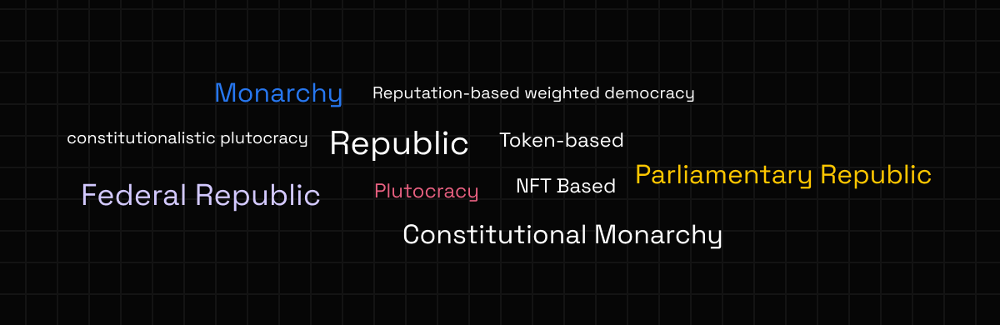

# 🏦 Government

The form of government of an organization is important. Jur allows for the creation of governance models of various kinds. Unlike DAOs, Network States can have forms of governance with different levels of centralization. Jur will build different governance models with Societies and will maintain a number of different modules to support different needs, drawing on existing models as reference:

<figure><figcaption></figcaption></figure>
