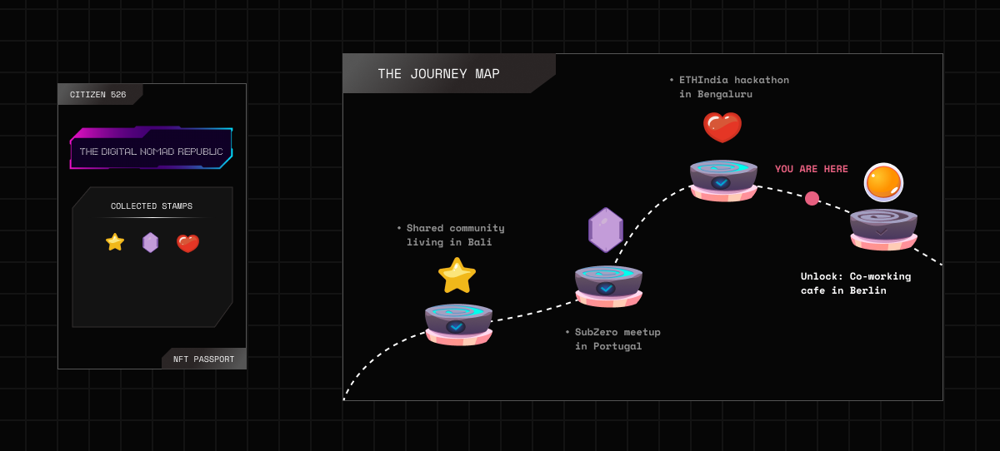

# 🔑 NFT Status

<figure><figcaption></figcaption></figure>

A citizen’s status is represented by an NFT. The NFT is dynamic, constantly updating with each interaction. The NFT will capture the journey of the citizen with the community. They are comparable to a user schema in a web2 product. Through the NFT, users can decide whom they want to share their information with.

An example of NFT Status is the NFT Passport. It can take many forms, initially non-transferable and burnable. The NFT may contain badges and stickers issued by the Founder in recognition of the contributions of the member of the society.

The NFT Status will play an important role in the stack. This is the perfect example of a bottom-up building approach. We are currently iterating on different models of NFT Passports.

We will keep this section updated. You can see in real time examples of implementation in Moonsama and in Jur.
